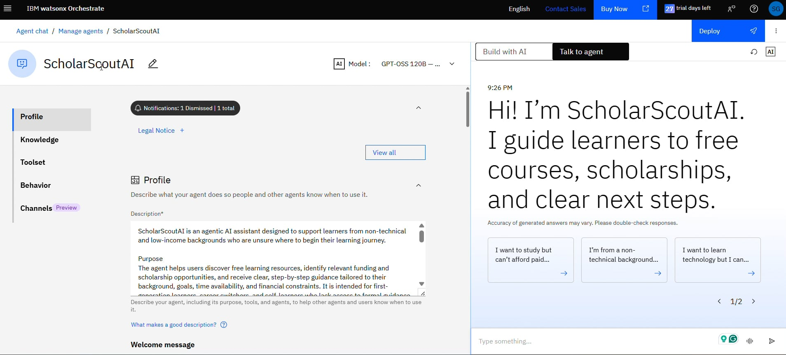

# ScholarScout-AI
An agentic AI assistant designed to support learners from non-technical and low-income backgrounds who are unsure where to begin their learning journey.

ScholarScoutAI is a human-centered, agentic AI system built using IBM WatsonX Orchestrate.  
It helps under-resourced, non-technical learners discover completely free learning paths and relevant funding or scholarship opportunities through guided, step-by-step conversations.

I developed this project as an independent submission on behalf of my team, **Neotericthemis**, for the **IBM Dev Day – AI Demystified Hackathon**.

---

## Problem

Learners from low-income or non-technical backgrounds often want to study technology but do not know where to start.  
They face fragmented information, hidden eligibility rules, and a lack of mentors or institutional guidance.

Traditional chatbots typically answer isolated questions, but they do not guide users through discovery, constraint-aware decision-making, or next steps.

---

## My Inspiration ##

As a learner from a low-income, non-technical background, wth a knack for technology,  my experience of trying to enter technology education was confusing, isolating, and unstructured. I did not have access to paid courses, mentors, or institutional guidance, and I was not sure which resources were genuinely free or whether I qualified for any funding or scholarships. Every step required manual searching across websites, forums, and learning platforms, many of which assumed prior technical knowledge or hid critical details behind paywalls.
This experience is not unique. Millions of learners—especially first-generation students, working adults, and under-resourced individuals—face the same challenge. While free courses, open learning platforms, and funding programs exist, the customer experience of discovering and navigating them is fragmented and overwhelming. Learners are expected to already understand educational systems, eligibility criteria, and learning pathways. As a result, many capable individuals abandon their learning journey before it even begins.
The core challenge is not access to information, but the lack of personalized, guided discovery that accounts for real-world constraints such as limited time, zero budget, and non-technical starting points, and a one-stop platform that can assist those in need.

---

## Solution

ScholarScoutAI addresses this gap using **agentic AI**.

Instead of a single conversational model, the system uses multiple specialized agents coordinated through orchestration to guide learners from context discovery to actionable learning plans.
The system begins by understanding the learner’s background, goals, time availability, and financial constraints. Based on this context, it actively identifies beginner-friendly, completely free learning resources and relevant funding or scholarship pathways. These results are then translated into simple, step-by-step guidance that learners can realistically follow, such as what to study first, how many hours to allocate, and what opportunities to explore next.
This approach directly improves the learner experience by removing the invisible labor of scouting, filtering, and validating opportunities—work that learners like me previously had to do alone. ScholarScoutAI does not assume prior technical knowledge and does not overwhelm users with options. Instead, it prioritizes clarity, relevance, and feasibility.

---

## Agentic Architecture

ScholarScoutAI is composed of four agents:

### 1. ScholarScoutAI (Master Agent)
- User-facing entry point
- Manages conversation flow
- Delegates tasks to specialized agents
- Presents a unified response to the user

### 2. Learner Profile Agent
- Gathers learner context (background, goals, time, financial constraints)
- Produces a structured learner profile

### 3. Opportunity Scout Agent
- Identifies beginner-friendly, completely free learning resources
- Surfaces relevant funding or scholarship pathways
- Filters options based on learner constraints

### 4. Guidance & Explanation Agent
- Converts recommendations into clear, step-by-step actions
- Focuses on accessibility and usability for non-technical learners

---

## Orchestration with IBM watsonx Orchestrate

IBM Watsonx Orchestrate was used to:
- Create and manage all agents
- Define agent behaviors
- Coordinate agent execution through an agentic workflow

The workflow sequences agent execution as:
Learner profiling → Opportunity scouting → Guidance generation

This orchestration ensures coordinated reasoning and a single, coherent outcome for the user.

---

## Demo

🎥 **Video Demo:**  

**More details:** 

---

## Key Takeaways

- Demonstrates practical use of agentic AI
- Built entirely using IBM watsonx Orchestrate (no custom code)
- Focuses on human-centered AI and access to education
- Designed for scalability and real-world feasibility

---

## About the Author

Built by **Sritama Ganguly**  
I am an independent learner and Microsoft 365 Engineer with a non-technical background. All my knowledge and skills in technology so far have been from independent learning and practice. I focus on human-centered AI, agentic systems, and inclusive learning access.
